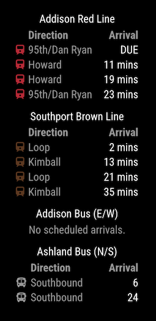

# MMM-CTA

This is a module for the [MagicMirror²](https://github.com/MichMich/MagicMirror/).

This module displays Chicago Transit Authority (CTA) bus and train arrival times.



## Installation

In ~/MagicMirror/modules
```sh
git clone https://github.com/JHWelch/MMM-CTA.git
```

Install NPM dependencies
```sh
cd MMM-CTA
npm install --production
```

## Obtaining CTA API keys

You need to obtain API keys to access CTA data. The API keys are two separate keys for two services.

- [Bus API](http://www.transitchicago.com/developers/bustracker.aspx)
- [Train API](http://www.transitchicago.com/developers/traintrackerapply.aspx)

The bus tracker API key can be obtained immediately, the train tracker key can take a few days to register.

## Using the module

To use this module, add the following configuration block to the modules array in the `config/config.js` file:
```js
var config = {
  modules: [
    {
      module: 'MMM-CTA',
      config: {
        // See below for configurable options
      }
    }
  ]
}
```

## Configuration options

| Option            | Required?    | Description                                                                         |
| ----------------- | ------------ | ----------------------------------------------------------------------------------- |
| `busApiKey`       | **Required** | See [Obtaining CTA API keys](#obtaining-cta-api-keys)                               |
| `trainApiKey`     | **Required** | See [Obtaining CTA API keys](#obtaining-cta-api-keys)                               |
| `stops`           | **Required** | Array of stops to display. See [`stops` option](#stops-option)                      |
| `updateInterval`  | *Optional*   | Refresh time in milliseconds <br>Default 60000 milliseconds (1 minute)              |
| `maxResultsBus`   | *Optional*   | Maximum number of bus results to display <br>Default `5`                            |
| `maxResultsTrain` | *Optional*   | Maximum number of train results to display <br>Default `5`                          |
| `routeIcons`      | *Optional*   | True/False - Display icons next to routes. <br>Default `true`                       |
| `showHeaders`     | *Optional*   | True/False - Display headers for each stop. <br>Default `true`                      |
| `suffixStyle`     | *Optional*   | Style of suffix for the arrival time. `long`, `short`, or `none` <br>Default `long` |

### `stops` option

The `stops` option is an array of objects. Each object represents a stop to display.

```js
{
  stops: [
    {
      type: 'bus',
      id: 561,
      name: 'Chicago and Milwaukee'
    },
    {
      type: 'train',
      id: 41410,
      name: 'Blue Line'
    }
  ]
}
```

| Property | Description                                                          |
| -------- | -------------------------------------------------------------------- |
| `type`   | Type of stop. Either `bus` or `train`                                |
| `id`     | Stop ID. See [Finding Stop IDs](#finding-stop-ids)                   |
| `name`   | Name of stop. This is displayed in the header of the stop's results. |

### Finding Stop IDs

1. Go to [CTA Trackers](https://www.transitchicago.com/tracker/) and select Train or Bus Tracker.
2. Search for your stop inside of the given app
3. Once you find your stop, obtain the Id. It will be the number at the end of the page's URL
   1. For train tracker, it may look like `?sid={id}`. The `id` is the stop ID.
   2. For bus tracker, it may look like `Southbound/{id}`. The `id` is the stop ID.

## Development

### Installation

```sh
npm install
```

### Testing

There is a test suite using Jest.

```sh
npm test
```

### Linting

```sh
# Run linting
npm run lint

# Fix linting errors
npm run fix
```


## Thanks

This module is inspired by [MMM-CTA from NateDee](https://github.com/NateDee/MMM-CTA).
